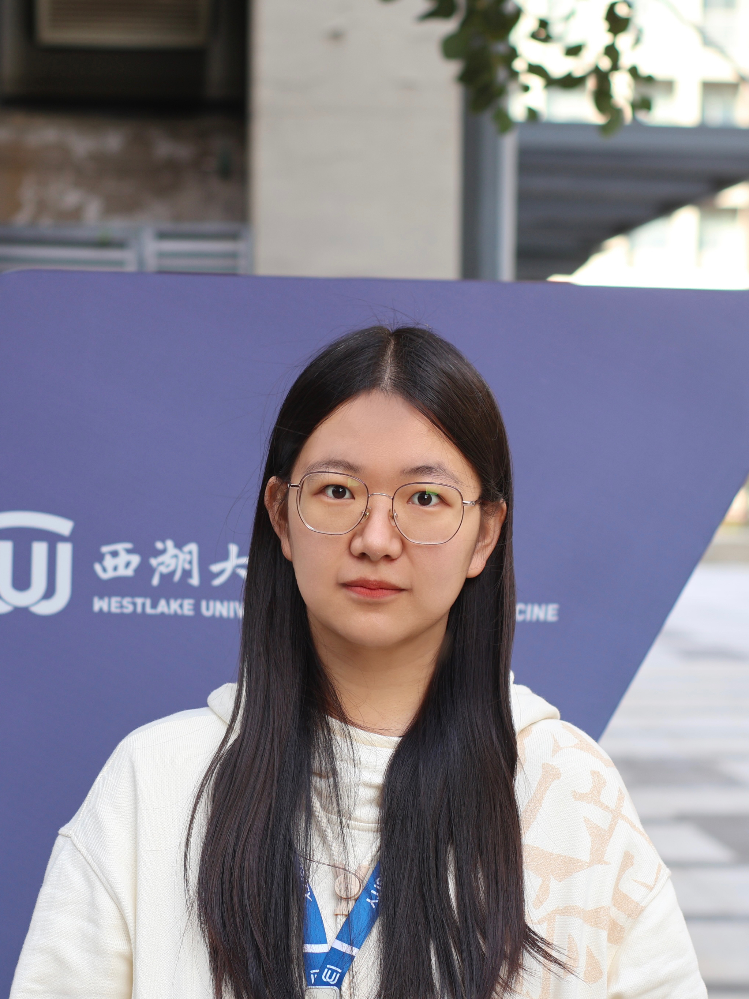
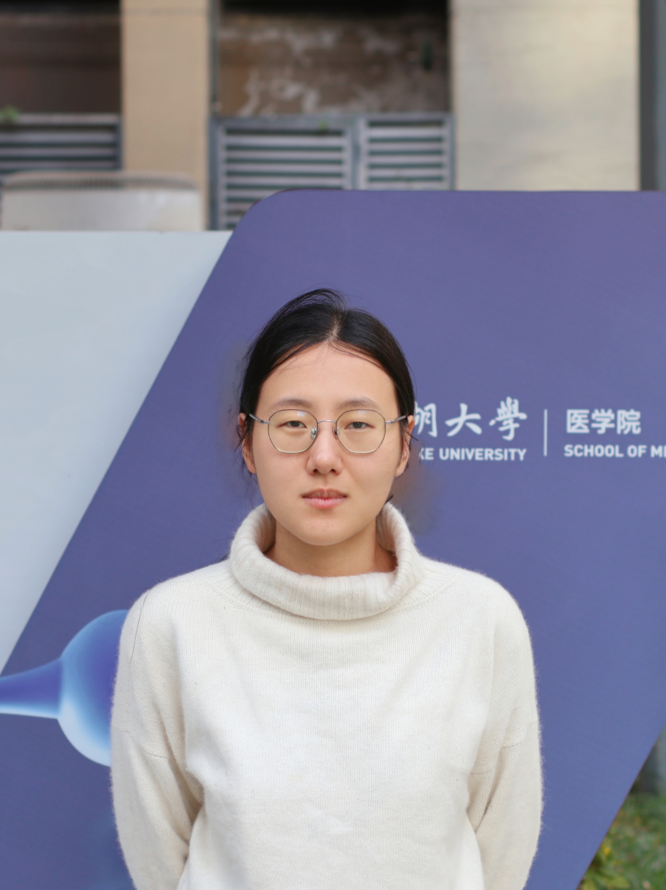

```{=html}
<style>
  footer {
    position: fixed;
    bottom: -50px;
    left: 0;
    width: 100%;
    background-color: black;
    text-align: left;
    padding: 10px 0;
    color: white;
    font-size: 14px;
    border-top: 1px solid rgba(0, 0, 0, 0.1);
    transition: transform 0.5s ease-in-out;
  }

  body {
    margin: 0;
  }

  footer.show {
    transform: translateY(-50px);
  }

  .profile {
    text-align: center;
    margin-bottom: 40px;
  }

  .profile img {
    width: 150px;
    height: 150px;
    border-radius: 50%;
    object-fit: cover;
    margin-bottom: 10px;
  }

  .team-container {
    display: flex;
    justify-content: center;
    flex-wrap: wrap;
    gap: 40px;
    margin-top: 30px;
  }

  .member-card {
    text-align: center;
    width: 200px;
  }

  .member-card img {
    width: 150px;
    height: 150px;
    border-radius: 50%;
    object-fit: cover;
    margin-bottom: 10px;
  }

  .member-card h4 {
    margin: 5px 0 2px;
    font-size: 16px;
  }

  .member-card p {
    margin: 2px 0;
    font-size: 14px;
  }

  .member-card a {
    font-size: 14px;
    color: blue;
    text-decoration: none;
  }
</style>


<script>
  document.addEventListener("scroll", function () {
    const footer = document.querySelector("footer");
    const scrollHeight = document.documentElement.scrollHeight;
    const scrollPosition = window.innerHeight + window.scrollY;

    if (scrollPosition >= scrollHeight) {
      footer.classList.add("show");
    } else {
      footer.classList.remove("show");
    }
  });
</script>
```

## Principal Investigator

```{=html}
<div class="profile">
  
<p><strong>Chong Chen (陈冲), M.D., Ph.D.</strong></p>
<p style="margin: 0 0;">Assistant Professor</p>
<p style="margin-top: 0; margin-bottom: 0;">
  <a href="mailto:chenchong@westlake.edu.cn">chenchong@westlake.edu.cn</a>
</p>
  <p><a href="files/CV_Chen_updated_07172025.pdf" download>Download CV</a></p>
</div>
```

## Team Members

```{=html}
<div class="team-container">

  <div class="member-card">
    
    <h4>Zixuan Zhuang (庄子璇)</h4>
    <p>Administrative Assistant</p>
    <p><a href="mailto:zhuangzixuan@westlake.edu.cn">zhuangzixuan@westlake.edu.cn</a></p>
  </div>

  <div class="member-card">
    
    <h4>Wenhui Tao (陶文慧)</h4>
    <p>Research Assistant</p>
    <p><a href="mailto:taowenhui@westlake.edu.cn">taowenhui@westlake.edu.cn</a></p>
  </div>

  <div class="member-card">
    
    <h4>Chan Yang (杨婵)</h4>
    <p>Research Assistant</p>
    <p><a href="mailto:yangchan72@westlake.edu.cn">yangchan72@westlake.edu.cn</a></p>
  </div>
    
  <!-- <div class="member-card"> -->
  <!--    -->
  <!--   <h4>Xiaowen Ma (马小雯)</h4> -->
  <!--   <p>Ph.D. Student</p> -->
  <!--   <p><a href="mailto:maxiaowen@westlake.edu.cn">maxiaowen@westlake.edu.cn</a></p> -->
  <!-- </div> -->
  
  <div class="member-card">
    
    <h4>Xinyu Fan (樊欣雨)</h4>
    <p>Research Assistant</p>
    <p><a href="mailto:fanxinyu@westlake.edu.cn">fanxinyu64@westlake.edu.cn</a></p>
  </div>
  
  <div class="member-card">
    
    <h4>Chengwei Jin (金城炜)</h4>
    <p>Undergraduate Student</p>
    <p><a href="mailto:jinchengwei@westlake.edu.cn">jinchengwei@westlake.edu.cn</a></p>
  </div>
  
    <div class="member-card">
    
    <h4>Yinxia Li (李银霞)</h4>
    <p>Postdoctoral Fellow</p>
    <p><a href="mailto:liyinxia@westlake.edu.cn">liyinxia@westlake.edu.cn</a></p>
  </div>
     
<div class="member-card">
    
    <h4>Xiaowen Ma (马小雯)</h4>
    <p>Ph.D. Student</p>
    <p><a href="mailto:maxiaowen@westlake.edu.cn">maxiaowen@westlake.edu.cn</a></p>
  </div>
  
    <div class="member-card">
    
    <h4>Yang Zhang (张杨)</h4>
    <p>Ph.D. Student</p>
    <p><a href="mailto:zhangyang23@westlake.edu.cn">zhangyang23@westlake.edu.cn</a></p>
  </div>
     
     <div class="member-card">
    
    <h4>Zhouwei Wang (王舟炜)</h4>
    <p>Ph.D. Student</p>
    <p><a href="mailto:wangzhouwei@westlake.edu.cn">wangzhouwei@westlake.edu.cn</a></p>
  </div>

   <div class="member-card">
    
    <h4>Junting Ye (叶俊廷)</h4>
    <p>Visiting Student</p>
    <p><a href="mailto:yejunting@westlake.edu.cn">yejunting@westlake.edu.cn</a></p>
  </div>
  </div>
    <!-- Alumni 部分，直接放在你当前文件的最末尾 -->
<div style="margin-top: 60px;">
  <h2 style="font-size: 28px; color: #333; margin-bottom: 20px; padding-bottom: 10px; border-bottom: 2px solid #eee;">Alumni</h2>
  
  <table style="width: 100%; border-collapse: collapse;">
    <thead>
      <tr style="border-bottom: 1px solid #ddd;">
        <th style="text-align: left; padding: 10px; color: #333; font-weight: 600;">Name</th>
        <th style="text-align: left; padding: 10px; color: #333; font-weight: 600;">Year</th>
        <th style="text-align: left; padding: 10px; color: #333; font-weight: 600;">Position</th>
        <th style="text-align: left; padding: 10px; color: #333; font-weight: 600;">Contact</th>
      </tr>
    </thead>
    <tbody>
      <!-- 👇 在这里添加你的校友信息，复制下面的<tr>模板即可 -->
      <tr style="border-bottom: 1px solid #eee;">
        <td style="padding: 10px;">Ziyu Zhou</td>
        <td style="padding: 10px;">2025.8-2025.9</td>
        <td style="padding: 10px;">Visiting Student</td>
        <td style="padding: 10px;"><a href=" " style="color: #0066cc; text-decoration: none;">zhouziyu2123@outlook.com<zhouziyu2123@outlook.com></a ></td>
      </tr>
      <tr style="border-bottom: 1px solid #eee;">
        <td style="padding: 10px;">Suxiu Zhang</td>
        <td style="padding: 10px;">2025.6-2026.4</td>
        <td style="padding: 10px;">Visiting Student</td>
        <td style="padding: 10px;"><a href="zhangsuxiu@westlake.edu.cn" style="color: #0066cc; text-decoration: none;">zhangsuxiu@westlake.edu.cn</a ></td>
      </tr>
    </tbody>
  </table>
</div>
```

<footer>Chen Lab \| Westlake © 2025 Hangzhou, Zhejiang Province, China</footer>
